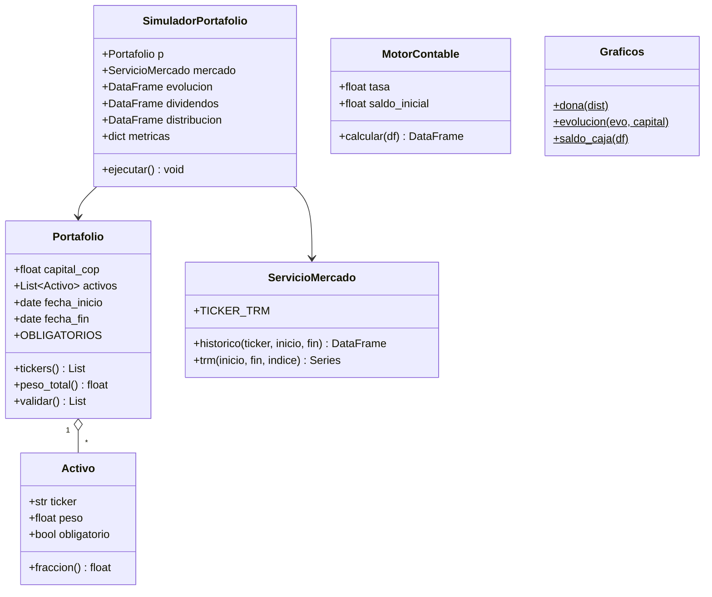

# Diagrama UML (Mermaid)

```mermaid
classDiagram
    class Activo {
        +str ticker
        +float peso
        +bool obligatorio
        +fraccion() float
    }
    class Portafolio {
        +float capital_cop
        +List~Activo~ activos
        +date fecha_inicio
        +date fecha_fin
        +OBLIGATORIOS
        +tickers() List
        +peso_total() float
        +validar() List
    }
    class ServicioMercado {
        +TICKER_TRM
        +historico(ticker, inicio, fin) DataFrame
        +trm(inicio, fin, indice) Series
    }
    class SimuladorPortafolio {
        +Portafolio p
        +ServicioMercado mercado
        +DataFrame evolucion
        +DataFrame dividendos
        +DataFrame distribucion
        +dict metricas
        +ejecutar() void
    }
    class MotorContable {
        +float tasa
        +float saldo_inicial
        +calcular(df) DataFrame
    }
    class Graficos {
        +dona(dist)$
        +evolucion(evo, capital)$
        +saldo_caja(df)$
    }
    Portafolio "1" o-- "*" Activo
    SimuladorPortafolio --> Portafolio
    SimuladorPortafolio --> ServicioMercado
```
